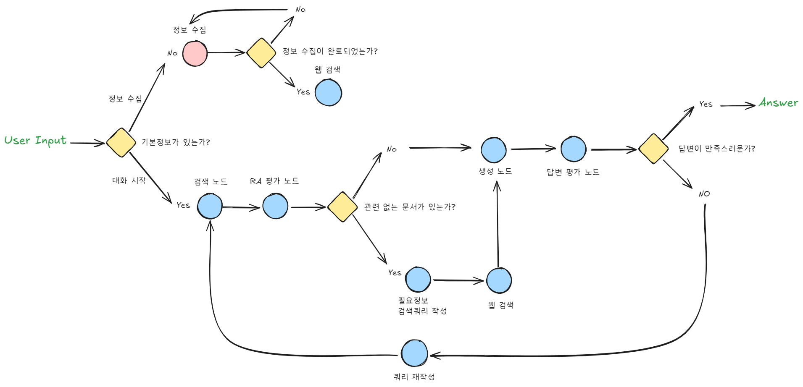

# Persona-ChatAgent
You can talk to any character you like. Set their name and personality, then start the conversation!


## Graph
The Below Image illustrates the flow of the Persona Chatbot.


## Requirement
```bash
pip install -r requirements.txt
```

## Setting API Keys
You need API keys for OpenAI and Tavily. Open the api_key.py file and enter your API keys.

```python
os.environ['OPENAI_API_KEY'] = "your_openai_api_key"
os.environ['TAVILY_API_KEY'] = "your_tavily_api_key"
```

## Streamlit Run
```bash
python -m streamlit run streamlit_app.py
```